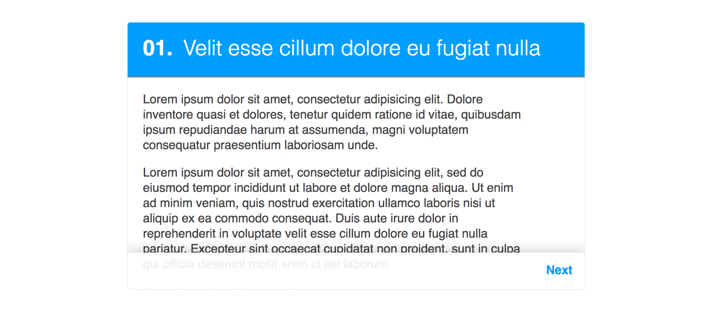
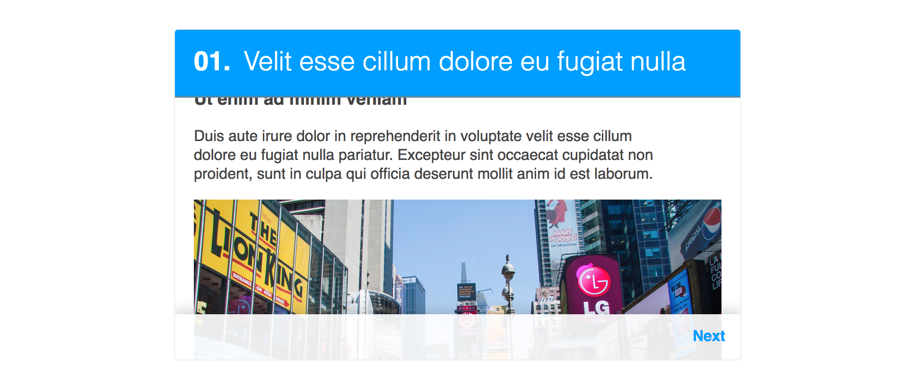
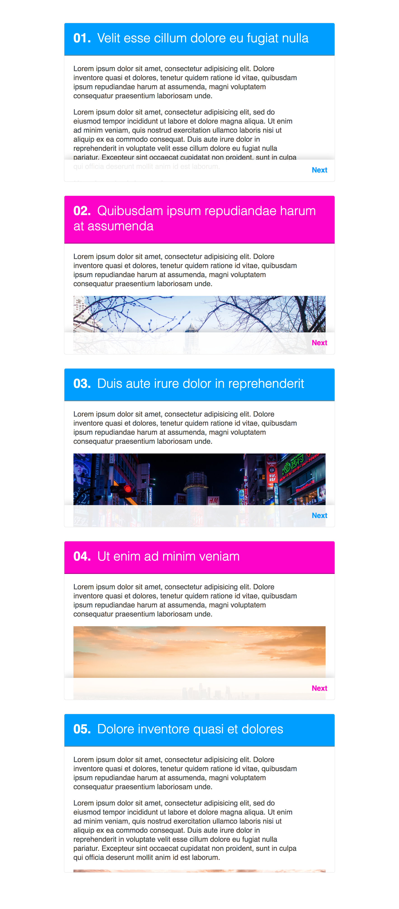

# Sticky cards

Let's create a card with scollable content:

* [] The card content can be text, headlines and images
* [] The text inside the card content does not extend to the right end of the card
* [] Images inside the card content are extending full width
* [] The headline of the card has a lighter font weight than the rest of the text
* [] The next button has some shadow and transparent background color

---------------

* [] The header of the card sticks to the top of the card when content is scrolled. **Make use of `position: sticky;`**.
* [] A next button stays at the bottom of the card. **Make use of `position: sticky;`**. Once all content is scrolled up, the next button should not overlap any content

---------------

Let's add few more cards - 5 sounds like a good number.

* [] Cards are themed in 2 themes: blue and pink

Every other card uses the blue theme.

---------------

## Extra:

* [] Last card has no next button, since there are no next sections coming after it - use CSS to hide the button
* [] First card has no previous button, since there are no previous sections coming before it - use CSS to hide the button
* [] The next button scrolls to the next section (**no JavaScript required here**)
* [] Add a previous button - it should appear on the left end of the card footer, and should scroll to the previous card (**no JavaScript required here**)